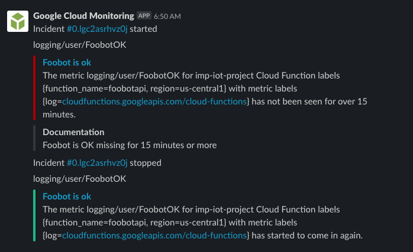

# Monitoring
In any IT system, there is a lot of stuff that can go wrong.
Machines crash, functions fail, networks break down,
configurations change, deployments are botched.
Ideally, the process we are implementing now, data collection, is a fire-and-forget activity. And we don't want
it to fail.
So how to we ensure that? In our case, there are no users that complain when the system is down.
We will just be missing data. And it happens, so we want to detect that.

So, our system needs to be monitored, and failure modes reported upon.

## Tooling
I have used many monitoring tools in the past, but for this project we are
looking at something a bit more native to the Google platform. That product is [Stackdriver]().
Stackdriver also has a pretty generous free allotment.

## What to monitor and alert
As with all monitoring and alerting, you want to focus measurement on
whatever is closes to the value you are providing.
In case of a website, you want to monitor if it can be accessed by users around the world. Even when the webserver is up, there can be many things standing between that server and the actual users.

In our case, we want data to be ingested into the database. The assumption of course is that it will be meaningful data. Interestingly, data ingestion rate is a native metric that Google Cloud provides.
```
Uploaded rows for foobot
Violates when: Any bigquery.googleapis.com/storage/uploaded_row_count stream is below a threshold of 0.001 for greater than 15 minutes
```
As we are pulling the information out of the API once every 10 minutes, our
update frequency should be around 1/(60*10) per second, or about 0.0017. Significant
deviations of this are an indicator that we are not getting the value we want.

It is tempting to try to measure correct functioning, e.g. as the absence of errors.
However, we have seen that there can be many function invocation errors that go undetected in that way. That is, they falsely claim to be ok.

Nevertheless, one could look at the 'staleness'
of data by looking at the frequency of 'ok' function executions. If there are
no recent 'ok' invocations, something must be wrong.

In Stackdriver Logging, you can define 'Logs-based metrics', for example to count
the number of `"status: 'ok'"` messages. Stackdriver Monitoring then allows to
alert on the absence of this metric (in our case 15 minutes).
An example error message then would look like this:

```
The metric logging/user/FoobotOK for imp-iot-project Cloud Function labels {function_name=foobotapi, region=us-central1} with metric labels {log=cloudfunctions.googleapis.com/cloud-functions} has not been seen for over 15 minutes.
```
This we can then sent to Slack.

I have noticed though that these metrics are not always available, leading to false alerts. Finally, with all GCP logging, there are retention limits that you need to think about. For example, logs will be retained between 30 and 400 days depending on the type.

## Performance Monitoring
Our code is not particularly resource intensive, nor is the result really time sensitive.
Still, it is dependent on external services that can have performance or
availability issues.

We do need some visibility into that.

Using Stackdriver: https://medium.com/@duhroach/getting-google-cloud-functions-times-in-stackdriver-61ec1b33a92

Using tracing on Python functions. https://medium.com/faun/tracing-python-cloud-functions-a17545586359

Continue to [miscellaneous topics](misc.md)
